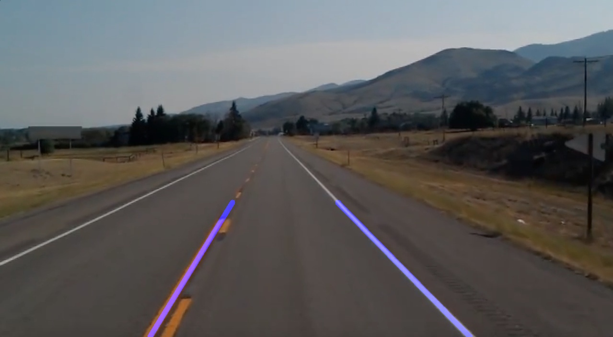

# Lanes detection on images and videos using OpenCV
My first project for road markings lanes' detection on images and videos using OpenCV.

This project is about using basics OpenCV's methods in order to detect road's markings (lanes detection) by processing the input image/video. In this repository you'll find an introduction to all these methods and their applications in real-time video.

## Introduction 

Every steps are explained in the **[introduction-functions](https://github.com/fredotran/lanes-detection-opencv/tree/main/introduction-functions)** folder which contains my [notebook](https://github.com/fredotran/lanes-detection-opencv/blob/main/introduction-functions/Introduction_to_road_markings_detection.ipynb)

## Utilities

You can find in this repository 2 Python files which contains utilities functions for this project : **[averaging_tools.py](https://github.com/fredotran/lanes-detection-opencv/blob/main/averaging_tools.py)** and **[markings_utils.py](https://github.com/fredotran/lanes-detection-opencv/blob/main/markings_utils.py)**

## Requirements

* [OpenCV 4.0 or higher](https://opencv.org/releases/) (you can also use the command on Windows/Linux Prompt : **pip install opencv-python**)
* [Python3 or higher](https://www.python.org/downloads/)
* Patience

## Results 

I tested my algorithms using these notebooks :

* [Notebook for images](https://github.com/fredotran/lanes-detection-opencv/blob/main/Algorithm_road_markings_detection_on_images.ipynb)
* [Notebook for videos](https://github.com/fredotran/lanes-detection-opencv/blob/main/Algorithm_road_markings_detection_on_videos.ipynb)

The following image is the result of applying these algorithms in the test image/video in order to detect lanes.

